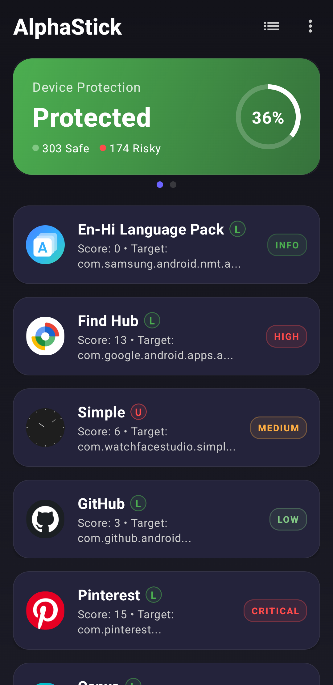
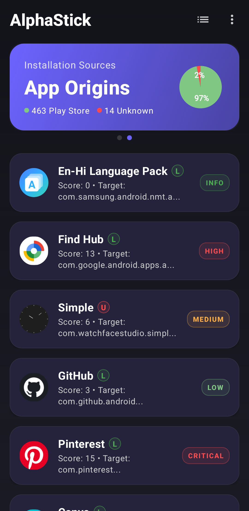
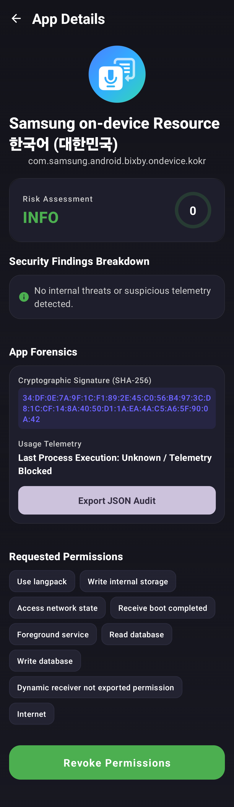
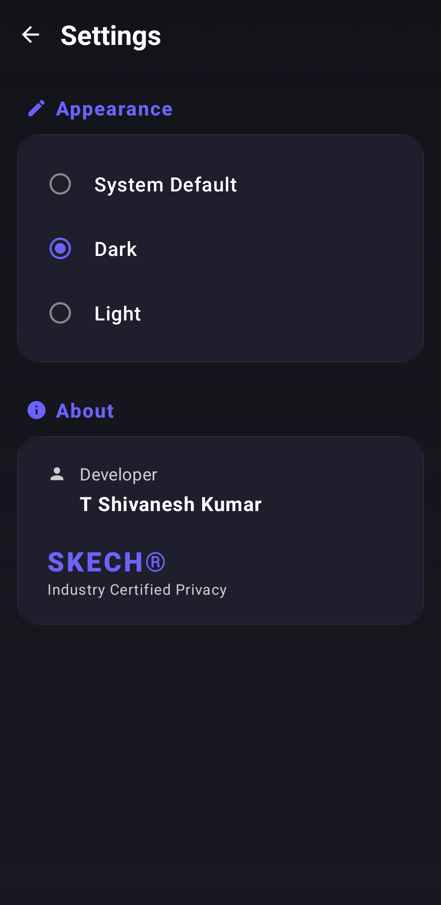

# AlphaStick

AlphaStick is a modular Android security auditing and risk analysis engine designed to evaluate installed applications using structured, explainable heuristics.

It focuses on transparent threat modeling, deterministic risk scoring, and false-positive-aware analysis, enabling users and developers to understand **why** an application is considered risky—not just **that** it is.

---

## Demonstration

### Video Overview

https://youtu.be/GrIQSmLcMbo

---

## Screenshots

### Device Risk Overview

Displays overall device protection level and risk distribution.

### Application Risk Analysis

Shows installed applications categorized by severity (INFO, LOW, MEDIUM, HIGH, CRITICAL) with calculated scores.

### Detailed App Forensics

Provides deep inspection including risk classification, security findings, cryptographic signature, telemetry, and permissions.

### Settings & Configuration

Application settings and developer information.

---

## Overview

AlphaStick performs on-device analysis by combining static inspection with behavioral inference. Instead of relying on opaque scoring, it produces **traceable security findings** backed by clearly defined logic and contextual validation.

The system is designed to:

* Detect insecure application configurations and exposed attack surfaces
* Identify privacy-sensitive or dormant applications with elevated permissions
* Provide explainable, factor-based risk scoring
* Minimize false positives through contextual awareness
* Deliver actionable mitigation guidance

---

## Installation

1. Download the latest APK from the releases page
2. Enable installation from unknown sources
3. Install and launch AlphaStick

[Download Latest Release](https://github.com/tshivaneshk/AlphaStick-Android/releases/download/v1.0.0/AlphaStick-v1.0.0.apk)

---

## Key Capabilities

### Modular Security Scanning Architecture

* Unified `AppScanner` interface for extensibility
* Independent scanning modules:

  * Permission analysis
  * Manifest configuration analysis
  * Usage-based behavioral analysis
  * Installer source validation
  * Cryptographic signature auditing
* Central orchestration via `ScanOrchestrator`

### Deterministic and Explainable Risk Scoring

* Rule-based scoring model with explicit contributing factors
* Each result includes:

  * Total risk score (0–100)
  * Individual risk factors with score impact
  * Severity classification
* Eliminates black-box scoring by exposing full reasoning

### Structured Security Findings Model

* Standardized `SecurityFinding` abstraction across all scanners
* Each finding includes:

  * Description and root cause
  * Severity (INFO, LOW, MEDIUM, HIGH, CRITICAL)
  * Confidence level (LOW, MEDIUM, HIGH)
  * Mitigation guidance

### Behavioral Risk Detection (Zombie Tracker)

* Identifies applications that:

  * Hold sensitive permissions
  * Remain unused for extended periods
* Highlights potential background data exposure risks
* Applies contextual filtering to reduce false positives

### Application Configuration Analysis

* Detects critical misconfigurations:

  * Debuggable builds in production
  * Backup-enabled data exposure risks
  * Cleartext network communication
  * Outdated target SDK versions

### Installer Source Intelligence

* Classifies applications based on installation origin
* Differentiates:

  * Trusted sources (Play Store, OEM marketplaces)
  * Unknown or sideloaded sources
* Uses OEM trust whitelist to prevent misclassification

### Cryptographic Signature Auditing

* Extracts application signing certificates
* Generates SHA-256 signature hashes
* Enables detection of repackaged or tampered applications

### False Positive Mitigation

* Context-aware validation layer
* Adjusts severity and confidence based on:

  * System application status
  * Trusted installer sources
* Prevents misleading alerts for legitimate applications

### JSON Audit Export

* Exports complete scan results in structured JSON format
* Includes:

  * Risk scores
  * Findings
  * Metadata
* Designed for sharing and external analysis

---

## System Flow

1. Application metadata is collected from the Android system
2. Modular scanners independently analyze different security dimensions
3. Findings are normalized into a structured model (`SecurityFinding`)
4. Risk factors are aggregated into a deterministic scoring engine
5. Results are presented with full explainability in the UI and export layer

---

## Architecture

AlphaStick follows a strict Clean Architecture model:

### Presentation Layer

* Jetpack Compose (Material 3)
* State-driven UI using StateFlow
* Lifecycle-aware re-scanning

### Domain Layer

* Risk scoring engine
* Security models and rule evaluation
* Scanner orchestration logic

### Data Layer

* Android system APIs (PackageManager, UsageStatsManager)
* Data extraction and transformation

### Design Principles

* Clear separation of concerns
* Modular and extensible components
* Deterministic and explainable logic
* Minimal reliance on external libraries

---

## Technology Stack

* Kotlin
* Jetpack Compose (Material 3)
* Clean Architecture
* MVVM (Model-View-ViewModel)
* Dagger Hilt (Dependency Injection)
* Kotlin Coroutines and StateFlow

---

## Use Cases

* Auditing installed applications for security weaknesses
* Identifying privacy risks in dormant applications
* Understanding Android application security at a system level
* Demonstrating modular security analysis architecture

---

## Limitations

AlphaStick is a **static and heuristic-based auditing tool**.

It does not:

* Perform real-time network traffic inspection
* Execute dynamic runtime or behavioral malware analysis
* Replace antivirus or endpoint protection solutions

All results should be interpreted as **risk indicators**, not definitive threat classifications.

---

## Project Status

This project is under active development. Detection logic and scoring models are continuously refined to improve accuracy and reduce false positives.

---

## License

This project is licensed under the MIT License.
